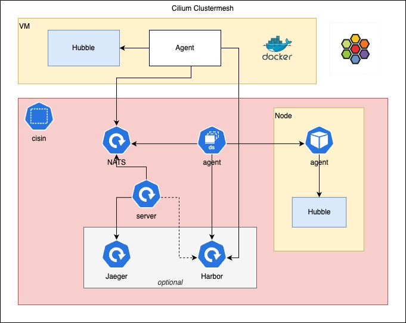

# CISIN

[TOC]

Imagine a CVE like Log4Shell occurs. Do you know which image in your cluster or which host in your network uses the
affected Library? Do you know if one of them uses this library, if the service is exposed to the internet? In many cases
probably you have to answer with no. This is where CISIN comes in. Based on the networking
tool [Cilium](https://cilium.io)
and the SBOM tool [Syft](https://github.com/anchore/syft), CISIN creates traces of your network traffic and enriches
them with URLs to the associated SBOM. Of course CISIN generates the SBOM for you, if there doesn't exist one for your
Workload.

## Prerequisites

To use CISIN you have to fulfill some prerequisites.

* Use Cilium as CNI for your Kubernetes cluster
* Enable Hubble in Cilium
* Have access to an OCI registry
* Install [NATS](https://nats.io/)
* Install [Jaeger](https://www.jaegertracing.io)
* Host only: Install [Docker](https://www.docker.com)

### Host

If you want to use CISIN not only inside your Kubernetes cluster, you need to add your hosts to the Cilium cluster mesh.
Follow the instruction in the [Cilium documentation](https://docs.cilium.io/en/stable/network/external-workloads/).
Please make sure that you enable Hubble on the hosts.

```shell
cilium clustermesh external-workload install --config enable-hubble=true cilium-install.sh
```

## Deployment

CISIN consists of two parts. The server part and the agent part. It is suggested that you install the server part in
your Kubernetes cluster. An installation on an external host could work, but is not tested. The agent part must be
installed on every host participating the Cilium cluster mesh. As the installation method vary for Kubernetes workload
to external hosts, please refer to [Kubernetes agent](#Agent) for Kubernetes Workload and [Host](#Host) for external
hosts. If you like to add you Kubernetes host to CISIN as well, please follow the steps for [Host](#Host) for your
Kubernetes hosts as well.

### Kubernetes

The Kubernetes deployment consists of two parts. The `server` and the `agent`. In [maniftests](./manifests) you can find
an example deployment including Jaeger for tracing, Harbor as OCI image registry and NATS for messaging.

Please note:

1. You have to adapt some values
2. You probably don't want to use the deployment manifests of Jaeger, Harbor and NATS with the
   provided manifests in production.

#### Server

CISIN server can be deployed as normal `Deployment`.
See [manifests/deployment-cisin-server.yaml](./manifests/deployment-cisin-server.yaml) for an example.

#### Agent

CISIN agent must run on every node in the cluster. To ensure this, CISIN needs to be deployed as `DaemonSet`.
See [manifests/dameonset-cisin-agent.yaml](./manifests/daemonset-cisin-agent.yaml) for an example.

**IMPORTANT**: This only adds your Kubernetes workload to the cluster. Not your Kubernetes hosts itself.

### Host

To enable CISIN agents to do it's work, you need to mount the Hubble socket and the root of your filesystem. Refer to
the following example command.

```shell
docker run --network host \
--name cisin \
-d \
-v /:/host \
-v /var/run/cilium/hubble.sock:/var/run/cilium/hubble.sock \
-e CISIN_REGISTRY_SECRET=<registry-secret> \
-e CISIN_REGISTRY_USERNAME=<registry-username> \
-e CISIN_NATS_ADDRESS=<NATS address> \
-e CISIN_CLUSTER_NAME=<Kubernetes cluster name> \
-e CISIN_NODE_TYPE=host \
cr.gitlab.fhnw.ch/cloud/mse-cloud/cisin:<tag>  agent 
```

### Options

There are a lot of options to run CISIN. All options available are displayed in the following.

#### Server

```shell
Usage: cisin server [flags]

Start CISIN server

Flags:
  -h, --help                                            Show context-sensitive help.

      --nats-address="localhost:4222"                   NATS address ($CISIN_NATS_ADDRESS)
      --nats-connection-subject="hubble"                Subject to receive flows ($CISIN_NATS_CONNECTION_SUBJECT)
      --nats-sbom-subject="sbom"                        Subject to recieve SBOM messages ($CISIN_NATS_SBOM_SUBJECT)
      --nats-connection-queue="hubble"                  Queue name to receive flows ($CISIN_NATS_CONNECTION_QUEUE)
      --nats-sbom-queue="sbom"                          Queue name to receive SBOM messages ($CISIN_NATS_SBOM_QUEUE)
      --otel-address="localhost:4317"                   Address to publish traces ($CISIN_OTEL_ADDRESS)
      --otel-service-name="cisin"                       Service name to use ($CISIN_OTEL_SERVICE_NAME)
      --k8s-config-path="/etc/kubernetes/admin.conf"    Path to Kubernetes config ($CISIN_K8S_CONFIG_PATH)
      --k8s-in-cluster                                  Use default Kubernetes config from pod ($CISIN_K8S_IN_CLUSTER)
      --workerpool-size=50                              Number of workers to process NATS messages ($CISIN_WORKER_POOL_SIZE)
      --workerpool-max-queue-size=1000                  Max. number of messages in queue to process ($CISIN_WORKER_POOL_MAX_QUEUE_SIZE)
      --log-level="info"                                Log level to use ($CISIN_LOG_LEVEL)
```

#### Agent

```shell
Usage: cisin agent --cluster-name=STRING [flags]

Start CISIN agent

Flags:
  -h, --help                                                      Show context-sensitive help.

      --node-name=STRING                                          Agent hostname ($CISIN_NODE_NAME)
      --cluster-name=STRING                                       Kubernetes cluster name ($CISIN_CLUSTER_NAME)
      --node-type="k8s"                                           Supported node types (k8s, host) ($CISIN_NODE_TYPE)
      --hubble-address="unix:///var/run/cilium/hubble.sock"       Hubble address ($CISIN_HUBBLE_ADDRESS)
      --hubble-subject="hubble"                                   NATS subject to publish flows ($CISIN_HUBBLE_SUBJECT)
      --nats-address="localhost:4222"                             NATS address ($CISIN_NATS_ADDRESS)
      --nats-noop                                                 Do not publish messages to NATS queue ($CISIN_NATS_NOOP)
      --k8s-config-path="/etc/kubernetes/admin.conf"              Path to Kubernetes config ($CISIN_K8S_CONFIG_PATH)
      --k8s-in-cluster                                            Use default Kubernetes config from pod ($CISIN_K8S_IN_CLUSTER)
      --log-level="info"                                          Log level to use ($CISIN_LOG_LEVEL)
      --src-modules=k8s_image,k8s_digest,...                      Agent modules for flow sources ($CISIN_SRC_MODULES)
      --dest-modules=k8s_image,k8s_digest,...                     Agent modules for flow destinations ($CISIN_DEST_MODULES)
      --image-src="containerd"                                    Image source ($CISIN_IMAGE_SOURCE)
      --image-src-namespace="k8s.io"                              Namespace for containerd image source ($CISIN_IMAGE_SOURCE_NAMESPACE)
      --registry-url="harbor.cisin.svc.cluster.local:80/cisin"    OCI registry URL ($CISIN_REGISTRY_URL)
      --registry-username="cisin"                                 OCI registry username ($CISIN_REGISTRY_USERNAME)
      --registry-secret=STRING                                    OCI registry secret ($CISIN_REGISTRY_SECRET)
      --registry-insecure                                         Do not use TLS to connect OCI registry ($CISIN_REGISTRY_INSECURE)
      --sbom-generation-interval=30s                              Interval to generate SBOMs ($CISIN_SBOM_GENERATION_INTERVAL)
      --sbom-subject="sbom"                                       NATS subject to publish SBOM information ($CISIN_SBOM_SUBJECT)
      --sbom-fs-root="/host"                                      Filesystem root to generate SBOMs on hosts ($CISIN_SBOM_FS_ROOT)
      --sbom-generate                                             Generate SBOMs ($CISIN_SBOM_GENERATE)
      --sbom-insecure                                             Do not use TLS to retrieve SBOMs from remote ($CISIN_SBOM_INSECURE)
      --cache-ttl=30s                                             Time before a message for a flow is resent ($CISIN_CACHE_TTL)
```

#### Analyze

```shell
Usage: cisin analyze list [flags]

List trace ids available

Flags:
  -h, --help                               Show context-sensitive help.

      --jaeger="http://localhost:14268"    Jaeger address
      --service-name="cisin"               Service name
```

```shell
Usage: cisin analyze sbom <trace-id> [flags]

Find vulnerabilities based on SBOM urls in trace tags

Arguments:
  <trace-id>    Trace ID to analyze

Flags:
  -h, --help                            Show context-sensitive help.

      --jaeger="http://jaeger:14268"    Jaeger address
      --service-name="cisin"            Service name
```

## Architecture

CISIN is split into two parts. The `server` (component `server` in image *Architecure*) part and the `agent` (
component `agent` in image *Architecure*) part. Both parts communicate with each other via the
messaging platform NATS (component `NATS` in image *Architecure*).

Based on Hubble (component `Hubble` in image *Architecure*) from Cilium the `agent` retrieves information about network
flows. If the source of the flow belongs to the host the agent is running on, it publishes a message to NATS. To avoid
flooding NATS with equal messages, the messages are cached for a certain time, before they are republished. Beside
listening for Hubble messages, the agent also generates SBOMs. If the agent is running inside a Kubernetes cluster, the
agent lists all images running in a container on the host. After retrieving the images, the agent checks, if there
already exists an SBOM for an image. If not it creates one and pushes it to the registry (component `Harbor` in image
*Architecure*). If the agent is running on a host the agent creates the SBOM based on the host filesystem. The SBOM
generation happens in predefined time intervals.

The server listens in parallel for flow and SBOM messages. On receiving SBOM message the server saves the URLs
to the SBOM along with its identifier in a map for later usage in trace generation. On receiving flow messages the
server evaluates the source and the destination and saves it in memory. In intervals the saved flows are evaluated, a
trace enriched with SBOM URLs built and sent to the observability tool (component `Jaeger` in image *Architecure*).


*Architecture*

## Code Structure

The package structure in CISIN is based on the recommendation in https://github.com/golang-standards/project-layout.
Nevertheless, the most important packages are explained here. If you like to browse the documentation you can use the
tool `godoc`.

```shell
go install golang.org/x/tools/cmd/godoc@latest
godoc -http localhost:8080
# Linux
xdg-open http://localhost:8080/pkg/gitlab.fhnw.ch/cloud/mse-cloud/cisin/
# Mac
open http://localhost:8080/pkg/gitlab.fhnw.ch/cloud/mse-cloud/cisin/
# Windows
start http://localhost:8080/pkg/gitlab.fhnw.ch/cloud/mse-cloud/cisin/
```

### [cmd](./cmd)

In package `cmd` you can find the commands supported by CISIN.

* [agent](./cmd/agent)
* [server](./cmd/server)
* [analyze](./cmd/analyze)
    * [list](./cmd/analyze/list)
    * [sbom](./cmd/analyze/sbom)

### [Agent](./internal/agent)

Package `agent` contains controller logic for the agent part of CISIN. It contains two control loops. The first control
loop generates SBOMs, publishes them to the registry and sends a message about the SBOM to the NATS queue. The second
control loop receives network flows from hubble, analyze them and publish them to NATS.

### [Server](./internal/agent)

Package `server` contains controller logic for the server part of CISIN. It contains two control loops. The first
control loop receives messages about created SBOMs and saves them in memory. The second control loop receives messages
about network flows and saves them in memory. The third control loop creates in interval traces based on the flows saved
in memory and enriches them with SBOM information.

### [Repository](./internal/repository)

Package `repository` contains interfaces to abstract access to external resources. Beside the abstraction, it also
contains packages with implementations of the defined interfaces. Through the abstraction it is possible to generate
mocks for testing, or it is easily possible to add new implementations.

### [Service](./internal/service)

Package `service` contains interfaces to abstract services. Beside the abstraction, it also contains with
implementations of the defined interfaces.

### [Agentmodule](./internal/agentmodule)

Package `agentmodule` contains an interface for agent modules. Agent modules are executed, if configured, for every
flow received in the agent. At the moment there exists a module to evaluate the image name and one to evaluate the
digest. Because of the interface it is easily possible to add new agent modules.

## Development


### Prerequisites

* [Golang](https://go.dev)
* [Buf](https://github.com/bufbuild/buf)
* [Docker](https://www.docker.com)

### Golang

To build CISIN run the following command:

```shell
go build -o cisin ./ gitlab.fhnw.ch/cloud/mse-cloud/cisin
```

### Protobuf

Messages sent to NATS are serialized with Protobuf. The message definitions are available in [proto](./proto). After
changes to the messages the Go stubs have to be regenerated.

```shell
go generate ./...
```

### Docker

There's a [Dockerfile](./package/Dockerfile) to build an image for CISIN.

```shell
docker build -t cisin -f ./package/Dockerfile .
```